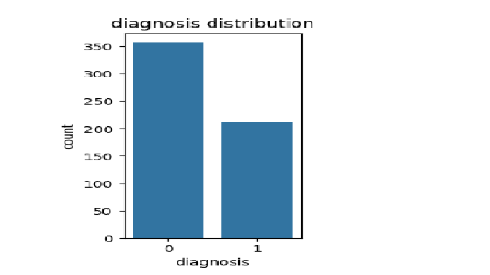
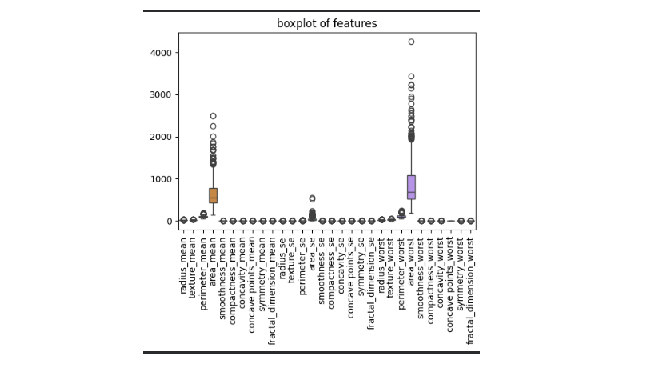
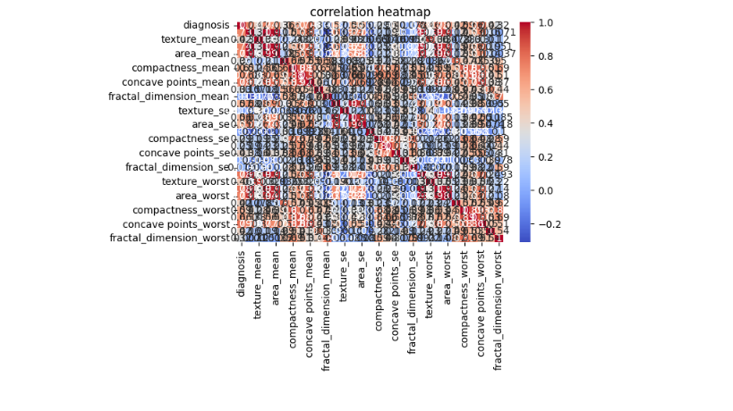

# breast_cancer_diagnosis
a machine learing model which classifies whether a person has diagnosis or not based on logistic regression
# Breast Cancer Diagnosis Prediction using Logistic Regression


## 📌 Project Overview

This project uses **Machine Learning and Logistic Regression** to predict whether a breast tumor is **Benign** or **Malignant** based on features extracted from breast cancer cell images.

The project uses the **Breast Cancer Wisconsin Diagnostic Dataset** from Kaggle.

The main objective is to understand the complete Machine Learning workflow, from **Exploratory Data Analysis (EDA)** and preprocessing to model training and evaluation.

---

## 📊 Dataset

The dataset contains measurements related to breast cell nuclei.

### Target Variable

* `B` → Benign
* `M` → Malignant

### Features

The dataset contains features related to:

* Radius
* Texture
* Perimeter
* Area
* Smoothness
* Compactness
* Concavity
* Concave points
* Symmetry
* Fractal dimension

These measurements are provided as mean, standard error, and worst values.

---

## 🛠️ Technologies Used

* Python
* Pandas
* NumPy
* Matplotlib
* Seaborn
* Scikit-learn
* Jupyter Notebook / Google Colab

---

## 🔍 Exploratory Data Analysis

The following visualizations were created to understand the dataset:

### Diagnosis Distribution




### Boxplots



### Correlation Heatmap



### Scatter Plot


---

## ⚙️ Data Preprocessing

The following preprocessing steps were performed:

1. Loaded the dataset using Pandas.
2. Removed unnecessary columns such as `id` and `Unnamed: 32`.
3. Converted the diagnosis into numerical values:

   * `B = 0`
   * `M = 1`
4. Separated the features (`X`) and target (`y`).
5. Split the dataset into training and testing sets.
6. Applied `StandardScaler` to scale the numerical features.

---

## 🤖 Model

### Logistic Regression

Logistic Regression was used because this is a **binary classification problem**.

The model predicts:

```text
0 → Benign
1 → Malignant
```

The model was trained using the scaled training data and then used to predict the test data.

---

## 📈 Model Evaluation

The model was evaluated using:

* Accuracy
* Confusion Matrix
* Precision
* Recall
* F1-score
* ROC-AUC


---

## 📁 Project Structure

```text
Breast-Cancer-Logistic-Regression/
│
├── data.csv
├── Breast_Cancer_Logistic_Regression.ipynb
├── images/
│   ├── diagnosis_distribution.png
│   ├── histograms.png
│   ├── boxplot.png
│   ├── correlation_heatmap.png
│   ├── scatterplot.png
│   ├── confusion_matrix.png
│   └── roc_curve.png
│
└── README.md
```

---


B.Tech CSE (AI & ML)
